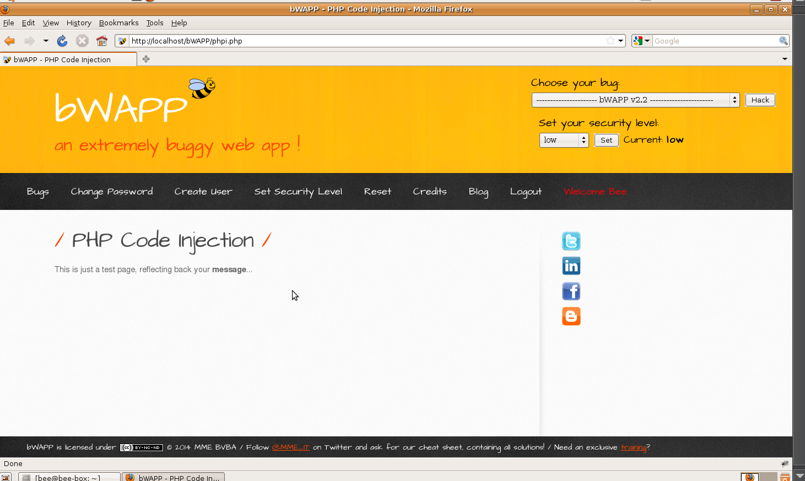
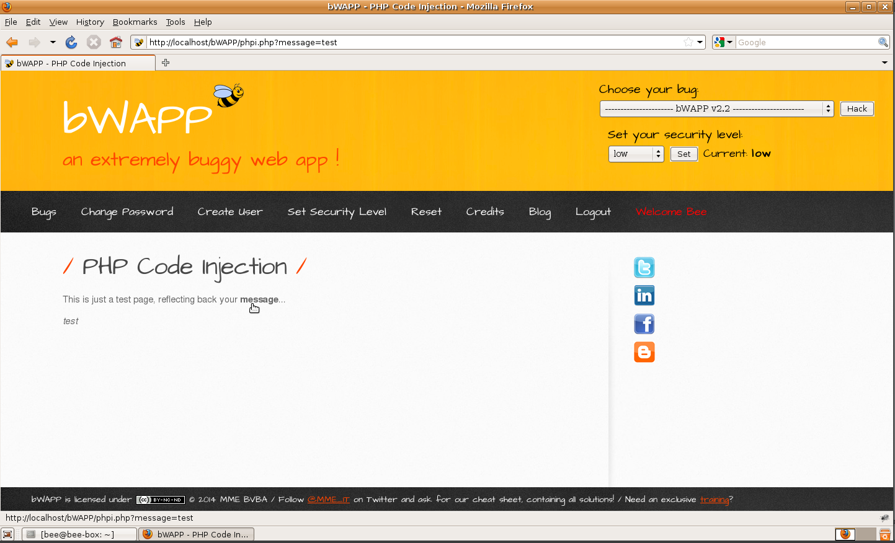
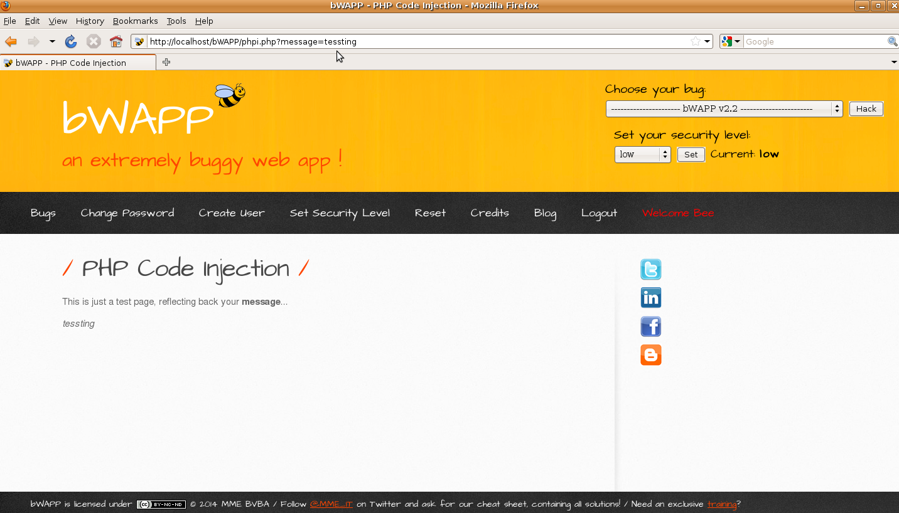

# `02` Verificación de la funcionalidad de la página


- La página debería mostrar una prueba de texto que incluye un enlace o un campo donde puedes ingresar un mensaje. Este enlace o campo está asociado con un parámetro GET en la URL.
 
 


### Verificación para la explotación de la Vulnerabilidad:
- Modificar el parámetro en la URL: En la página de prueba, identifica el parámetro GET en la URL que se utiliza para mostrar el mensaje. Este parámetro suele ser algo como ?message=test.



- Primero, cambia el valor del parámetro a una palabra arbitraria para confirmar que el parámetro está siendo procesado. Por ejemplo:

```bash
message=testing
```

- Verifica que la página muestre "testing" como mensaje.


