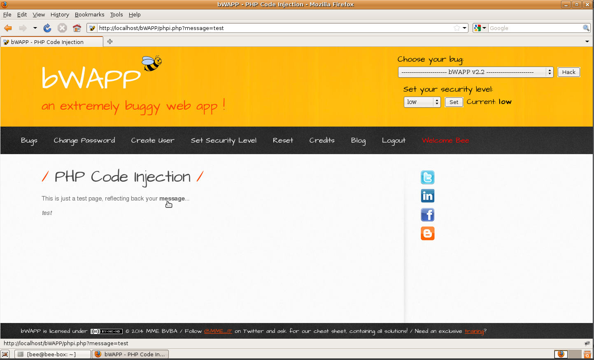

# `02` Verifying the Functionality of the Page

- The page should display a test text that includes a link or a field where you can enter a message. This link or field is associated with a GET parameter in the URL.  


### Verification for Exploiting the Vulnerability:

1. **Modify the parameter in the URL**: On the test page, identify the GET parameter in the URL that is used to display the message. This parameter is usually something like `?message=test`.  
   
  

2. **Change the value of the parameter**: First, change the parameter value to an arbitrary word to confirm that the parameter is being processed. For example:

    ```bash
    message=testing
    ```

3. **Verify the displayed message**: Check that the page displays "testing" as the message.  

