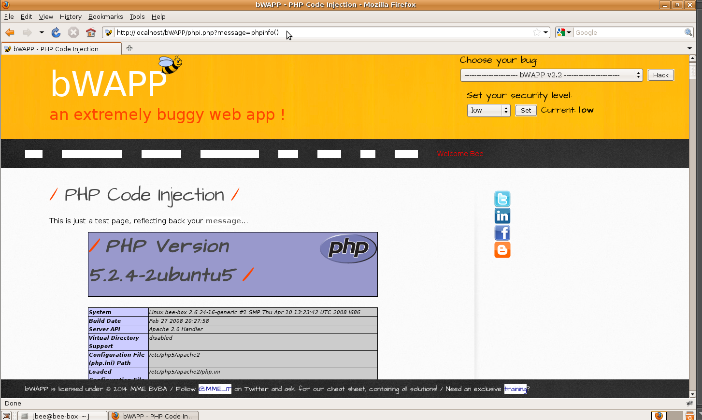

# `03` Explotar la vulnerabilidad  Inyección de Código PHP

### Inyectar Código PHP:

Reemplaza el valor del parámetro GET con phpinfo() para ejecutar el código PHP. Modifica la parte de la URL a:

```bash
message=phpinfo()
```

Esto debería mostrar la configuración de PHP, incluyendo detalles sobre las librerías, archivos de configuración y rutas del servidor.



### Verificación de la Inyección:

- Confirma los Resultados de la Inyección: Asegúrate de que la página muestra correctamente la información de phpinfo(), confirmando que la inyección ha sido exitosa.