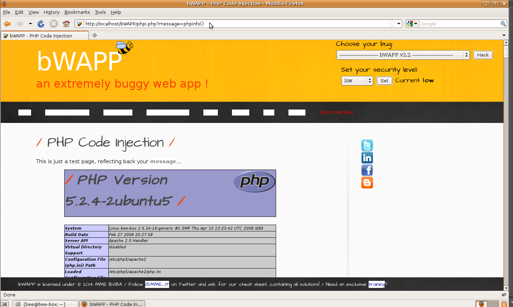

# `03` Exploiting the PHP Code Injection Vulnerability

### Injecting PHP Code:

Replace the value of the GET parameter with `phpinfo()` to execute PHP code. Modify the URL to:

```bash
message=phpinfo()
```

This should display the PHP configuration, including details about libraries, configuration files, and server paths.



### Verification of the Injection:

- Confirm the Injection Results: Ensure that the page correctly displays the phpinfo() information, confirming that the injection has been successful.