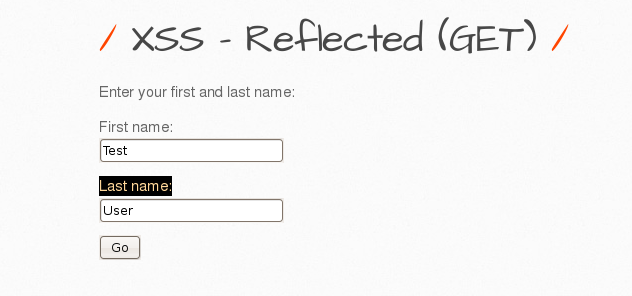
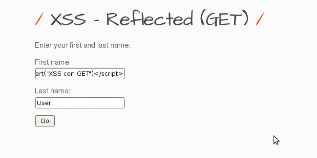

# `04` Explotación de Cross-Site Scripting (XSS) Reflected (GET)

### Cross-Site Scripting (XSS) Reflected (GET)

- Selecciona la vulnerabilidad 


### Explota la Vulnerabilidad:

1. Envia datos a través del Formulario:
- En la página que se abre, verás un formulario que solicita First name y Last name.
- Introduce cualquier valor en ambos campos, por ejemplo:

```bash
First name: Test
Last name: User
```



- Al enviar el formulario, verás que los valores ingresados se muestran como un mensaje en la página y también se incluyen en la URL como parámetros GET. Algo similar a esto:

```bash
http://localhost/bWAPP/xss_get.php?firstname=Test&lastname=User
```


2. Inyectar el Script XSS en el Formulario: 

- En lugar de valores regulares, ingresa el siguiente script en cualquiera de los campos del formulario para inyectar un ataque XSS:

```bash
First name: <script>alert('XSS con GET')</script>
Last name: User (o cualquier otro valor) form alert get  
```


 

- Al enviar el formulario, el script se ejecutará, mostrando una alerta con el mensaje "XSS con GET".

 

3. Verificación de la Explotación:
- Confirma los Resultados de la Explotación: Asegúrate de que la página muestra la alerta correctamente, confirmando que la inyección de XSS ha sido exitosa.

> Observa que en GET los datos ingresados son visibles en la URL, lo que hace que este método sea más fácil de explotar y compartir, pero también más evidente.