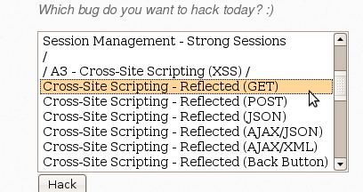
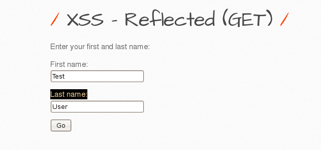
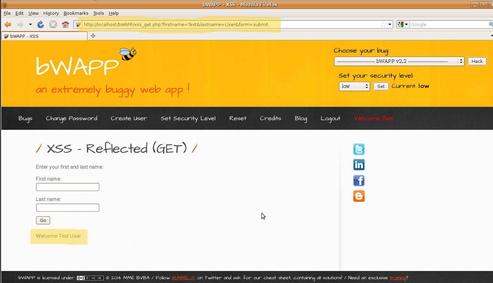
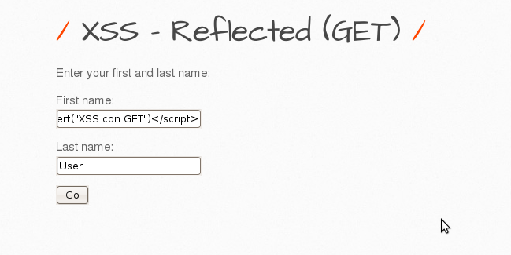
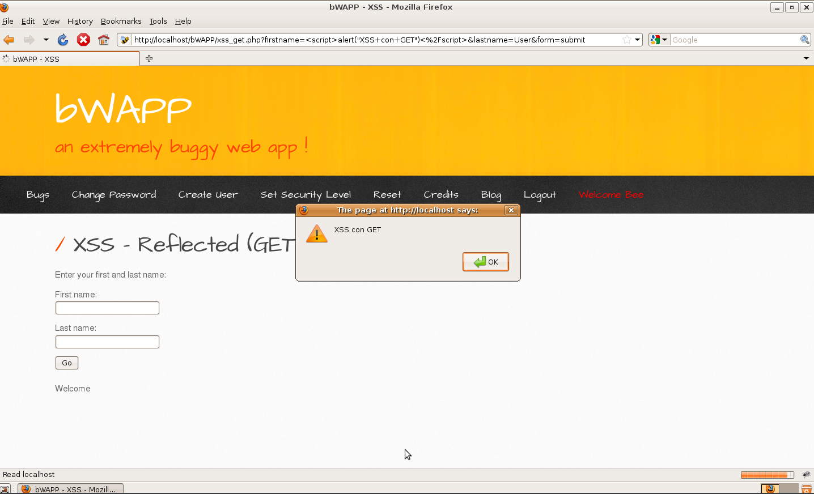

# `04` Exploiting Cross-Site Scripting (XSS) Reflected (GET)

### Cross-Site Scripting (XSS) Reflected (GET)

- Select the vulnerability



### Exploit the Vulnerability:

1. Submit Data via the Form:
   - On the page that opens, you will see a form asking for a First name and Last name.
   - Enter any values in both fields, for example:

```bash
    First name: Test
    Last name: User
```


   - After submitting the form, you will see the entered values displayed as a message on the page, and they will also be included in the URL as GET parameters, similar to this:

```bash
http://localhost/bWAPP/xss_get.php?firstname=Test&lastname=User
```

 

2. Inject the XSS Script into the Form:

- Instead of regular values, enter the following script in any of the form fields to inject an XSS attack:

```bash
    First name: <script>alert('XSS with GET')</script>
    Last name: User (or any other value)
```
 

   - When you submit the form, the script will execute, displaying an alert with the message "XSS with GET".

 

3. Verification of the Exploitation:
   - Confirm the Exploitation Results: Ensure that the page correctly displays the alert, confirming that the XSS injection was successful.

> Note that with GET, the data entered is visible in the URL, making this method easier to exploit and share, but also more obvious.