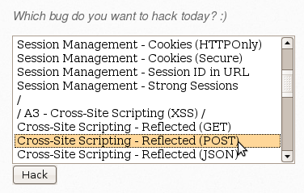
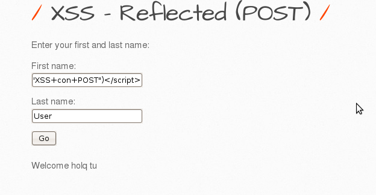
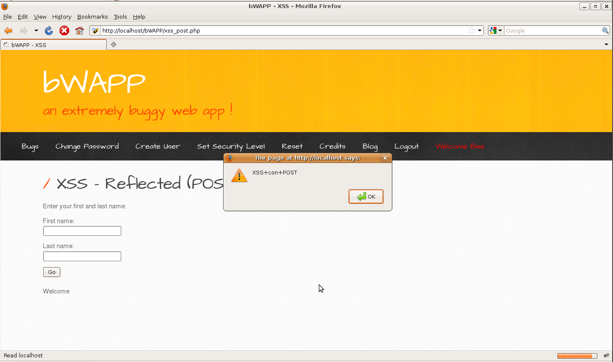

# `05` Explotación de Cross-Site Scripting (XSS) Reflected (POST)

### Cross-Site Scripting (XSS) Reflected (POST)

- Selecciona la vulnerabilidad 



### Explota la Vulnerabilidad:

1. Envia datos a través del Formulario:
- En la página que se abre, verás un formulario que solicita First name y Last name.
- Introduce el siguiente script en cualquiera de los campos del formulario para inyectar un ataque XSS

```bash
First name: <script>alert('XSS con POST')</script>
Last name: User (o cualquier otro valor)
```



- Al enviar el formulario, el script se ejecutará, mostrando una alerta con el mensaje "XSS con POST".




3. Verificación de la Explotación:
- A diferencia del método GET, aquí no verás los parámetros en la URL, ya que se envían en el cuerpo de la solicitud POST.
- Verifica que la alerta se muestre en la página, confirmando que la inyección de XSS ha sido exitosa.

### Resumen sobre GET y POST en XSS:
- **GET**: Los datos se muestran en la URL, lo que lo hace más fácil de explotar y compartir, pero más visible.
- **POST**: Los datos se envían en el cuerpo de la solicitud, lo que hace que el ataque sea menos visible, pero más complicado de ejecutar y compartir sin interacción del usuario.

**Ambos métodos permiten ejecutar scripts maliciosos en el navegador de la víctima si la página no sanitiza adecuadamente las entradas, pero cada uno tiene sus particularidades en cuanto a la explotación y visibilidad.**

Practicar con scripts más avanzados, como redirecciones, robo de cookies o keyloggers, te permitirá explorar las diferentes formas en que un ataque XSS puede ser explotado.