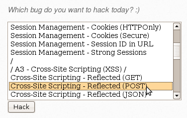
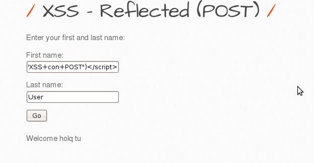
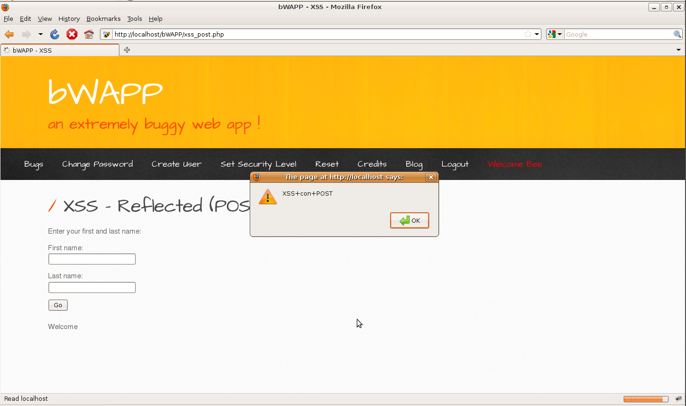

# `05` Exploiting Cross-Site Scripting (XSS) Reflected (POST)

### Cross-Site Scripting (XSS) Reflected (POST)

- Select the vulnerability



### Exploit the Vulnerability:

1. **Submit Data via the Form**:
- On the page that opens, you will see a form asking for a First name and Last name.
- Enter the following script in any of the form fields to inject an XSS attack:

```bash
First name: <script>alert('XSS with POST')</script>
Last name: User (or any other value)
```



- When you submit the form, the script will execute, displaying an alert with the message "XSS with POST".



2. **Verification of the Exploitation**:
- Unlike the GET method, you will not see the parameters in the URL here, as they are sent in the body of the POST request.
- Verify that the alert is displayed on the page, confirming that the XSS injection was successful.

### Summary of GET and POST in XSS:
- **GET**: Data is displayed in the URL, making it easier to exploit and share but more visible.
- **POST**: Data is sent in the body of the request, making the attack less visible but more difficult to execute and share without user interaction.

**Both methods allow malicious scripts to be executed in the victim's browser if the page does not properly sanitize inputs, but each has its particularities regarding exploitation and visibility.**

Practicing with more advanced scripts, such as redirects, cookie theft, or keyloggers, will allow you to explore the different ways an XSS attack can be exploited.